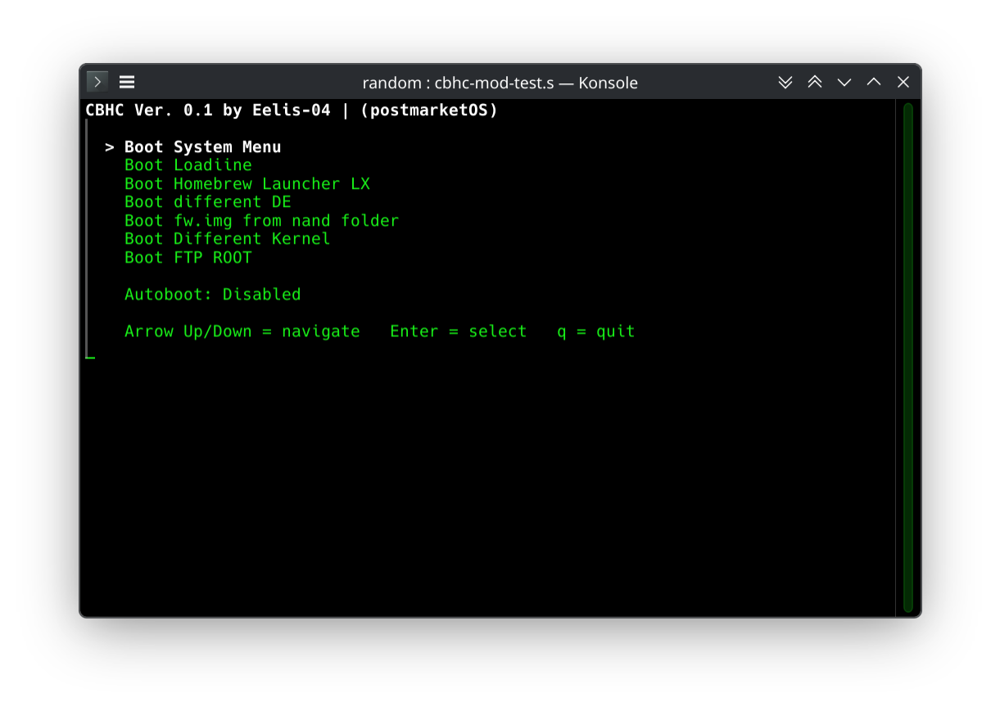

# CBHC-mod – Coldboot Menu for PostmarketOS

**CBHC-mod** is an early-boot boot menu / tool for PostmarketOS mobile Linux devices, inspired by the **Coldboot Haxchi (CBHC)** from the Wii U homebrew scene by FIX94 and the community.

It intercepts the boot process right after the kernel loads (in the initramfs), providing a simple text-based menu to choose boot options, debug, recover, or experiment — all without needing a PC (most of the time).


## Screenshots


### Currently Implemented (v0.1 – Prototype / Test Phase)

- **Keyboard-driven test menu** (for local Arch Linux / desktop development):
  - Arrow Up/Down to navigate
  - Enter to select
  - q to quit
  - Basic ANSI-colored text interface (white on black, top-left style)
  - Placeholder entries (most say "Not yet implemented")

- **Planned real features (coming soon in initramfs hook)**:
  - Auto-boot script/ app/ whatever
  - "Boot System Menu" (normal PostmarketOS boot)
  - (Debug shell fallback)
  - Early wireless root access (WiFi + SSH/FTP as root – "FTP Root")
  - kexec-based instant kernel switching (test new kernels without full reboot. Whenever this will be implemented and working is not clear yet)
  - Boot image backup/restore

### Why This Exists (Or will exist :p)

PostmarketOS already has powerful initramfs debugging (hold Vol Up → root shell over USB), but there's no polished, always-available boot menu/recovery environment like TWRP or Wii U CBHC.  
This project aims to fill that gap: make tinkering, kernel testing, and possibly recovery easy and seamless on phones running pmOS.

### Features Roadmap

- [x] Basic text splash + auto-boot delay (initramfs version)
- [ ] Button polling (Volume Up/Down) for real devices
- [ ] Configurable auto-boot via flag file (/boot/cbhc-autoboot)
- [ ] Wireless SSH/FTP server in initramfs ("FTP Root")
- [ ] kexec kernel switcher
- [ ] Companion GUI app in PostmarketOS (CBHC Manager – download kernels, set flags)
- [ ] Safety features: warnings, (backups, auto-revert)
- [ ] Per-device testing (Pixel 3a, Fairphone 5, VM first)

### Installation (Prototype or whatever u wanna call it)

This is **not installable yet** on real devices — it's in development.

For testing the keyboard prototype on Arch (or any other):

```bash
git clone https://github.com/eelis-04/cbhc-mod.git
cd cbhc-mod
chmod +x test-menu.sh
./test-menu.sh
